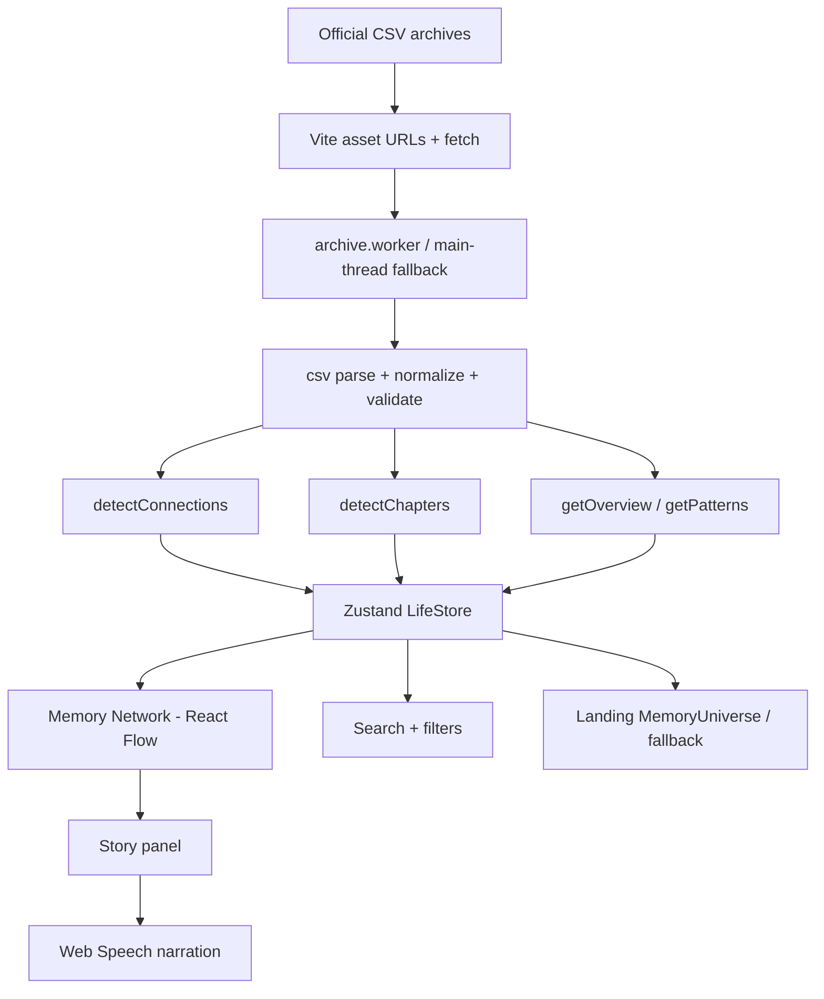

# Your Life, In Receipts

A frontend-only museum of one digital life. Official household, Spotify, and India-transaction archives are normalized into receipts, linked by evidence, and explored through an interactive Memory Network.

This repository is a **Frontend Arena / WebRush** hackathon submission. There is no backend, no database, and no authentication.

---

## 1. Project Overview

**Problem.** Life-log datasets are usually shown as dashboards: counts, charts, and static cards. A judge cannot tell, in ten seconds, that two rows belong to the same evening.

**Solution.** Every valid CSV row becomes a *receipt* (a timestamped moment). A relationship engine attaches a written reason to every edge. The Memory Network is the primary navigation: click a moment, see why it is connected, follow the story, optionally hear it narrated.

The first screen is meant to read: *these are fragments of someone’s digital life; click a moment and follow its connections.*

---

## 2. Core Concept

```
Raw CSVs  →  Insights  →  Connections  →  Stories
```

| Stage | What happens in this repo |
| --- | --- |
| **Raw data** | Three official files under `archive (1) (1)/`, `archive (3)/`, and `archive (2) (1)/` are fetched as Vite assets. |
| **Insights** | `getOverview` / `getPatterns` / `detectChapters` count hours, locations, artists, and household categories from those receipts. Copy is interpolated from the counts. |
| **Connections** | `detectConnections` emits edges with `reason` + `detail` (never random links). |
| **Stories** | Selecting a node builds a short path, opens a story panel, can walk the path visually, and can narrate it with the Web Speech API. |

Nothing in the insight or story layers invents receipts that were not parsed from the archives.

---

## 3. Features

Implemented in the current codebase:

- **Interactive Memory Network** — React Flow graph of real receipts; pan, zoom, click node, click edge, double-click to focus. Modes: Moments, Places, Time.
- **Receipt exploration** — story panel (title, time, location, description, “why this matters”), plus `/moment/:id` sequence view.
- **Relationship discovery** — stored `detail` on every edge; “Why are these connected?” when a line is selected.
- **Follow the story** — silent camera walk along the connected path.
- **Tell the story** — optional voice narration that highlights the same path. Never autoplays.
- **Search** — header `/` shortcut; `/search` matches title, description, tags , location, type, timestamp, and selected extra fields. Arrow keys + Enter on results.
- **Filtering** — category chips (only types present in the loaded archive), year rail, month rail, night/evening lenses from discoveries.
- **Journey** — `/journey` opens the network in time-layout mode.
- **Insights / discoveries** — pattern cards with Trace / Explain this; derived at load from the archive.
- **Chapters** — three chapters, one per official source (Spotify / household / India), shown on Discoveries.
- **Landing 3D** — optional `MemoryUniverse` (R3F) on desktop when reduced-motion is off; 2D fallback otherwise.
- **Responsive shell** — sidebar on `md+`, bottom nav on small screens, compact narration dock.
- **Accessibility extras** — skip link, focus-visible styles, dialog labelling, live toasts, keyboard graph list, reduced-motion landing skip of 3D.

Not claimed: backend sync, maps SDK, user accounts, or photo/message/search/note receipts unless those types actually appear after normalization (the type union includes them; the official CSVs currently map to music, purchase, place, movie, and event).

---

## 4. How It Works

```
Official CSVs
    ↓  fetch + CSV parse (Web Worker when available)
Normalization (skip rows without a parseable timestamp)
    ↓  validate + sanitize + dedupe by id
Relationship detection (capped, reason on every edge)
    ↓
Insight + chapter generation (counted, not invented)
    ↓
Zustand LifeStore (receipts, edges, edgesByNode, cached overview/patterns)
    ↓
Interactive Memory Network (sampled connected subgraph)
    ↓
Story panel → Follow the story / Tell the story
```

Load path: `store.load` → `loadOfficialArchive` → worker `buildArchiveBundle` (or main-thread fallback) → UI.

---

## 5. Dataset

**Source of truth.** Original files, imported with Vite `?url`. They are not rewritten.

| Archive | Path | Role in the app |
| --- | --- | --- |
| Household ledger | `archive (1) (1)/Daily Household Transactions.csv` | Purchases, places, events, occasional movie subscriptions |
| Spotify history | `archive (3)/spotify_history.csv` | Music receipts (`track_name`, `artist_name`, `ts`, …) |
| India card file | `archive (2) (1)/Augmented_IndiaTransactMultiFacet2024.csv` | Purchases / places / movies / events from `category`, `merchant`, `city`, `state`, `amt` |

**Normalized receipt** (`src/data/types.ts`): `id`, `type`, `timestamp`, `title`, `description`, optional `location`, `tags[]`, optional `amount` / `currency`, `source`, `extra`.

**Normalization rules (actual):**

- Rows with no parseable date are **skipped** (`fromHousehold` / `fromSpotify` / `fromIndia` return `null`).
- Household dates are day-first (`DD/MM/YYYY`); India dates are month-first (`MM/DD/YYYY`); Spotify uses ISO-like `ts`.
- Type mapping is field-driven (household `Category`, India `category`, Spotify always `music`).
- Location is taken from household note tokens or India `city` + `state` — never geocoded.
- `validateReceipt` drops malformed objects; `dedupeReceipts` keeps the first id.
- Card-number columns from the India file are **not** copied onto the `Receipt` model.

Row counts are computed at runtime and shown in the UI. This README does not hardcode those totals.

---

## 6. Relationship Engine

Implemented in `src/data/connectionEngine.ts`. Each edge has `{ a, b, reason, detail, weight }`.

| Reason emitted | Rule |
| --- | --- |
| `temporal` | Consecutive records within **90 minutes** (max 3 look-ahead). Same-source + same-type pairs beyond 45 minutes are skipped. |
| `same-day` | Mixed type/source on the same calendar day. |
| `same-location` | Sequential receipts sharing a location key (length ≥ 3). |
| `same-entity` | Same artist, person, or India merchant, only if also within 48 hours. |
| `shared-tags` | Rare keywords from real tags (generic `music` / `purchase` / … excluded; tag must appear on 2–40 receipts). |

Caps: **10,000** edges globally, **8** per node. Pairwise similarity across the full archive is intentionally not run.

The type union also lists `same-week` and `explicit-mention`; **those reasons are not produced by the current detector.**

---

## 7. Architecture



UI routes: `/` landing, `/overview` home + network, `/journey` time mode, `/network` network, `/discoveries` patterns + chapters, `/search`, `/moment/:id`. Legacy `/connections`, `/patterns`, `/places`, `/chapters` redirect.

---

## 8. Technology Stack

From `package.json` (runtime):

| Library | Version range | Use |
| --- | --- | --- |
| React / React DOM | 19.2.1 | UI |
| Vite | 8.3.0 | Build, CSV `?url` assets, workers |
| TypeScript | 5.8 | Types |
| Tailwind CSS | 3.4.19 | Styling |
| React Router DOM | 7.18.x | Client routes |
| Zustand | 5.0.x | App state |
| @xyflow/react | 12.x | Memory Network |
| @react-three/fiber + drei + three | 9.x / 10.x / 0.186 | Landing scene only |
| Framer Motion | 13.x | Page / panel motion |
| Lucide React | 1.47.x | Icons |

Tooling: ESLint 9, Vitest 5, Testing Library, jsdom.

**Not used:** backend, auth SDK, map SDK, Recharts, GSAP (removed), sample `bundle.json`.

---

## 9. Project Structure

```
FrontEnd_Arena/
├── archive (1) (1)/          # official household CSV
├── archive (2) (1)/          # official India transactions CSV
├── archive (3)/              # official Spotify CSV
├── public/
├── src/
│   ├── App.tsx
│   ├── store.ts              # Zustand LifeStore + edgesByNode index
│   ├── store.test.ts
│   ├── components/           # network, narration dock, UI, ErrorBoundary
│   ├── data/                 # csv, normalize, connections, chapters, worker
│   ├── hooks/                # narration, mobile, reduced motion
│   ├── layouts/              # AppShell, Header, Sidebar
│   ├── lib/                  # sanitize, validateReceipt
│   ├── pages/                # Landing, Overview, Journey, Network, Discoveries, Search, Moment
│   ├── scene/                # MemoryUniverse (landing 3D)
│   ├── utils/                # insights, graph sample, narration copy, format
│   └── test/                 # Vitest setup
├── vercel.json
├── vite.config.ts
├── eslint.config.js
└── package.json
```

---

## 10. Installation

Requires Node.js capable of running Vite 8.

```bash
npm install
npm run dev
```

Open the URL Vite prints (typically `http://localhost:5173/`). First load fetches and parses the official CSVs; wait for “Reading official archives” to finish.

---

## 11. Production Build

```bash
npm run build
npm run preview
```

Output directory: `dist/`. CSVs are emitted as hashed assets under `dist/assets/`.

---

## 12. Testing

Vitest + React Testing Library. Command:

```bash
npm run test
```

Watch mode: `npm run test:watch`.

Current suites (under `src/**/*.test.ts(x)`):

| File | What it checks |
| --- | --- |
| `data/csv.test.ts` | Quoted fields, BOM |
| `data/normalize.test.ts` | Invalid dates skipped; household/Spotify mapping |
| `data/connectionEngine.test.ts` | Temporal, location, shared-tag edges; no edges for a lone receipt; `buildEdgeIndex` |
| `utils/networkGraph.test.ts` | Year/location graph sample; story path from real edges; place co-occurrence reason |
| `store.test.ts` | Receipt selection, `applyTrace`, `clearLenses`, indexed `neighborIds` |
| `utils/analyzeData.search.test.ts` | Empty / title / location / type / extra.artist search |
| `lib/sanitize.test.ts` | Control chars; `javascript:` URLs rejected |
| `lib/validateReceipt.test.ts` | Malformed records; duplicate ids |
| `hooks/useNarration.test.ts` | Pause/resume/stop; no autoplay |
| `components/network/StoryPanel.test.tsx` | Dialog name; Escape closes selection |
| `pages/Search.test.tsx` | Combobox labelling; arrows; Escape clears query |
| `components/FilterChips.test.tsx` | Accessible name; category filter; All resets types |
| `components/ErrorBoundary.test.tsx` | Recovery actions instead of a blank screen |

These tests use small fixtures. They do not download the full production CSVs.

---

## 13. Accessibility

Implemented (not a WCAG audit certificate):

- `lang="en"` on `index.html`, skip-to-content link in `AppShell`
- Buttons for interactive controls (stats, discoveries, filters, narration)
- `:focus-visible` outline in `src/index.css`
- Header search labelled; `/` focuses it when not typing in another field
- Story panel: `role="dialog"`, `aria-modal`, labelled heading, Escape closes
- Toasts: `role="status"` `aria-live="polite"`
- Loading archive: `role="status"`
- Filter chips: `role="group"` + `aria-pressed`
- Memory Network: visible list of up to 20 moments in the current sample (keyboard alternative to the canvas)
- Search combobox pattern with `aria-activedescendant` and arrow-key movement
- `prefers-reduced-motion`: landing skips R3F; CSS disables dust / core pulse
- Color is not the only cue: type icons + labels sit on nodes and list rows

Gaps that remain: no full screen-reader QA pass, no jsx-a11y ESLint plugin (peer conflict with current ESLint), graph canvas itself is pointing-device oriented.

---

## 14. Performance

Implemented optimizations:

- Archive parse/connect/insight work runs in a **module Web Worker**, 120s timeout, then main-thread fallback
- Overview, patterns, years, and top location stats are **computed once at load** and stored
- Graph **layout** is memoized separately from selection highlighting (`MemoryEdge` / nodes read selection from the store)
- Neighbor lookups use `buildEdgeIndex` (`edgesByNode`) so selection does not scan every edge
- Graph sample: 96 nodes desktop, **48 on mobile**; related types kept when filtering
- Connection detector is capped (see §6)
- `React.lazy` for Overview, Journey, Network, Discoveries, Search, Moment, and `MemoryUniverse`
- Landing 3D uses `frameloop="never"` while `document.hidden`
- Search results are **capped** (40 on the search page)
- Reduced motion skips the heavy landing scene

Honest limits: the Spotify CSV is a large static asset; first load still transfers and parses the official files in the browser. The canvas cannot draw every row.

---

## 15. Security

Frontend-only practices in this repo:

- Dataset strings rendered as React text, not HTML
- `sanitizeText` strips control characters; `safeUrl` allows only `http:` / `https:`
- `validateReceipt` before a row enters the store
- India `cc_num` is not mapped onto receipts
- No API keys or `.env` secrets in source
- `localStorage` holds narration **settings only** (rate, volume, voice URI, enabled flag)
- Google Fonts are loaded over HTTPS from `index.html` (third-party stylesheet)

---

## 16. Responsive Design

| Viewport | Behavior |
| --- | --- |
| `md` and up | Left sidebar, header search, full narration dock label |
| Below `md` | Bottom nav (Home / Journey / Network / Discover), story panel above the nav, compact 🔊 control |
| Mobile / reduced motion | No landing WebGL; 2D fallback; smaller graph sample; fewer 3D particles if the scene does run |

Year/month chips scroll horizontally. Network height is `min(68vh, 640px)`.

---

## 17. Browser Compatibility

Target: **evergreen Chromium** (Chrome, Edge) with ES2022, Web Workers, `speechSynthesis`, and WebGL.

Not claimed as verified: Safari, Firefox, in-app webviews, or assistive-technology certification. If `speechSynthesis` is missing, the UI shows that voice is unsupported and the visual walk still works. If the worker fails, parsing falls back to the main thread.

---

## 18. Deployment

Static hosting on **Vercel**:

1. Push this Git repository.
2. Import the project; Framework Preset **Vite**.
3. Build command: `npm run build`
4. Output directory: `dist`
5. No environment variables required.

`vercel.json` rewrites non-asset paths to `index.html` so client routes (`/network`, `/discoveries`, …) work on refresh.

Do not commit tokens. Preview locally with `npm run preview` after a production build.

---

## 19. Design Philosophy

The product is a **digital memory explorer**, not an admin dashboard. Counts exist only when they start an action (filter, trace, jump to time). The brightest surface is the network. Cards that did nothing were removed or given Trace / Explain / Explore.

Typography is editorial; the palette is dark and restrained. Neon is limited so relationship lines stay readable.

---

## 20. Demo Flow

Suggested judge path (about two minutes):

1. **Landing** — title, live counts from the loaded archive, “Enter the memory network”.
2. **Home / Overview** — four interactive stats, then the Memory Network.
3. Click a **node** — panel opens; connected moments list with reasons.
4. Click a **connection line** — “Why are these connected?”
5. **Follow the story** — camera walks the path.
6. **Tell the story** — optional voice; dock shows pause/stop.
7. **Discoveries** — Trace a pattern or Explain this; or Tell this chapter.
8. **Search** — `/`, type a song or place, Enter to focus it on the network.

---

## 21. Future Improvements

Not implemented today (backlog only):

- Service-worker caching of CSV assets
- Virtualized search over the full archive (beyond the capped result set)
- Screen-reader walkthrough of every graph node, not only the 20-item list
- Tailwind 4 migration (kept on 3.4.19 to preserve existing theme tokens)
- Independent Lighthouse / Safari QA
- Map view using coordinates (India file has lat/long; the UI uses named locations, not a map)

---

## 22. Credits / Hackathon

- **Challenge:** Frontend Arena — *Your Life, In Receipts* (WebRush frontend hackathon)
- **Constraint honored:** frontend only; official local archives as the single source of truth
- **Team / author:** as submitted on the contest platform

Official CSV files remain the organizers’ dataset. This app only parses and visualizes them in the browser.
